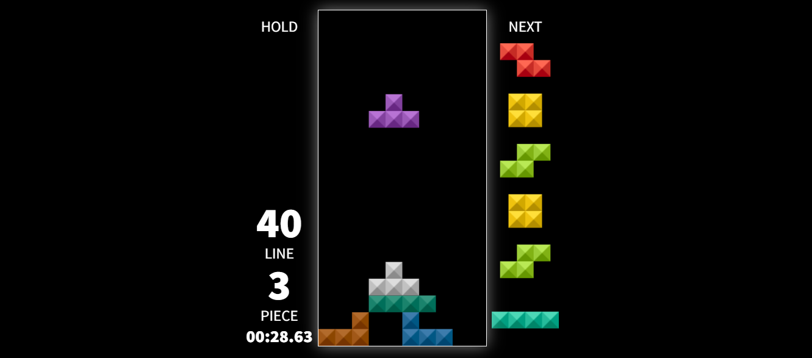

# JOGO DO TETRIS 03
👨‍💻JOGO DO TETRIS COM HTML, CSS E JS.

  

## DESCRIÇÃO:
O jogo é uma versão simplificada de Tetris. Ele envolve a movimentação e rotação de peças (tetrominoes) que caem em uma grade. O objetivo é completar linhas horizontais para removê-las e evitar que as peças se acumulem até o topo da tela. O código gerencia a lógica do jogo, o desenho das peças e a interação do usuário.

## JOGANDO:
1. **Controles:**
   - **Mover para a esquerda:** ← (Seta para a esquerda)
   - **Mover para a direita:** → (Seta para a direita)
   - **Mover para baixo:** ↓ (Seta para baixo)
   - **Girar para a direita:** X
   - **Girar para a esquerda:** Z
   - **Girar 180 graus:** Shift
   - **Caída rápida:** Space (Barra de espaço)
   - **Segurar peça:** C
   - **Pausar:** Esc

2. **Interface:**
   - **Tela de Jogo:** Mostra o campo de jogo onde as peças caem.
   - **Tela de Peças Ativas:** Exibe a peça que está caindo atualmente.
   - **Tela de Peças Pendentes:** Mostra a próxima peça que vai cair.
   - **Tela de Peças em Espera:** Mostra a peça que você segurou.
   - **Configurações:** Permite ajustar configurações como tamanho da célula, som, e volume.

3. **Configurações e Ajustes:**
   - **DAS (Delayed Auto-Shift):** Configura o atraso para movimentação automática das peças.
   - **ARR (Auto-Repeat Rate):** Ajusta a taxa de repetição automática das peças.
   - **Gravidade:** Define a velocidade com que as peças caem.
   - **Soft Drop:** Ajusta a velocidade de queda quando a peça é movida para baixo.
   - **Lock Delay:** Define o atraso antes que a peça seja fixada no lugar.

## NÃO SABE?
- Entendemos que para manipular arquivos em `HTML`, `CSS` e outras linguagens relacionadas, é necessário possuir conhecimento nessas áreas. Para auxiliar nesse aprendizado, oferecemos cursos gratuitos disponíveis:
* [CURSO DE HTML E CSS](https://github.com/VILHALVA/CURSO-DE-HTML-E-CSS)
* [CURSO DE JAVASCRIPT](https://github.com/VILHALVA/CURSO-DE-JAVASCRIPT)
* [CURSO DE CANVAS](https://github.com/VILHALVA/CURSO-DE-CANVAS)
* [CONFIRA MAIS CURSOS](https://github.com/VILHALVA?tab=repositories&q=+topic:CURSO)

## CREDITOS:
- [PROJETO CRIADO PELO "simonlc"](https://github.com/simonlc/tetr.js)
- [PROJETO EDITADO PELO VILHALVA](https://github.com/VILHALVA)
